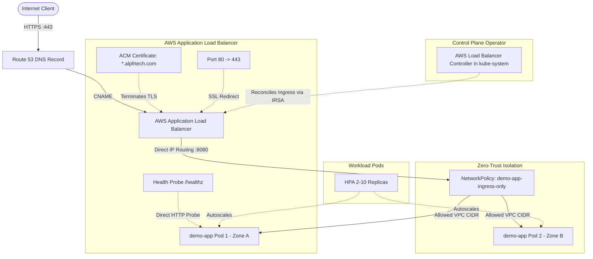

# AWS EKS Auto Mode + AWS ALB + AWS Load Balancer Controller + ACM + Route 53

[](https://github.com/alpfr/dns-lb-ingress-service-pods/actions/workflows/ci.yml)
[](https://aws.amazon.com/eks/)
[](https://www.terraform.io/)
[](https://aws.github.io/eks-charts)
[](https://aws.amazon.com/route53/)
[](https://opensource.org/licenses/MIT)

A production-grade, enterprise-hardened Terraform starter demonstrating automated end-to-end traffic ingress on **Amazon EKS Auto Mode**, routing from a custom Route 53 domain through an **AWS Application Load Balancer (ALB)** with **AWS Certificate Manager (ACM)** TLS termination, managed directly via the **AWS Load Balancer Controller**, routing traffic with zero worker-node proxy overhead straight to microservice pod IPs (`target-type: ip`).

---

## Architecture Overview
 
<p align="center">
  
</p>

```
                                      AWS CLOUD INFRASTRUCTURE
 ───────────────────────────────────────────────────────────────────────────────────────────────────
                                         
   [Internet Client]
          │
          │ HTTPS (443) / TLS
          ▼
   [Amazon Route 53] ── (DNS: app.alpfrtech.com -> ALB DNS Name | CAA: amazon.com)
          │
          ▼
 ┌─────────────────────────────────────────────────────────────────────────────────────────────────┐
 │ AWS Application Load Balancer (Internet-Facing ALB - AWS Managed Control Plane)                 │
 │                                                                                                 │
 │   • TLS Termination: ACM Public Certificate (*.alpfrtech.com / app.alpfrtech.com)               │
 │   • Automated HTTP-to-HTTPS SSL Redirection (Port 80 -> 443)                                    │
 │   • Target Type: IP (Direct Routing from VPC Subnets to Microservice Pod IPs)                   │
 │   • Dedicated HTTP Health Probe: /healthz on container traffic-port                             │
 │   • Zero Worker Node Ingress Overhead (No Ingress-NGINX proxy pods needed on nodes)             │
 └───────────────────────────────────────────────────┬─────────────────────────────────────────────┘
                                                     │
                                                     │ Direct Pod IP Routing (Port 8080)
                                                     ▼
 ┌─────────────────────────────────────────────────────────────────────────────────────────────────┐
 │ Amazon EKS Cluster (EKS Auto Mode: Node Pools: "general-purpose")                               │
 │                                                                                                 │
 │   Namespace: kube-system                                                                        │
 │   ┌─────────────────────────────────────────────────────────────────────────────────────────┐   │
 │   │ AWS Load Balancer Controller (Operator managing ALB Ingress via IRSA)                   │   │
 │   └─────────────────────────────────────────────────────────────────────────────────────────┘   │
 │                                                                                                 │
 │   Namespace: default                                                                            │
 │   ┌─────────────────────────────────────────────────────────────────────────────────────────┐   │
 │   │ Kubernetes Service: demo-app (ClusterIP)                                                │   │
 │   │   • TargetPort: 8080                                                                    │   │
 │   │ Kubernetes Ingress: demo-app (ingressClassName: "alb")                                  │   │
 │   └─────────────────────────────────────────────┬───────────────────────────────────────────┘   │
 │                                                 │                                               │
 │                                                 ▼                                               │
 │   ┌─────────────────────────────────────────────────────────────────────────────────────────┐   │
 │   │ Zero-Trust Kubernetes NetworkPolicy (demo-app-ingress-only)                             │   │
 │   │   • Restricts Ingress on Port 8080 strictly to VPC CIDR IP blocks                       │   │
 │   └─────────────────────────────────────────────┬───────────────────────────────────────────┘   │
 │                                                 │                                               │
 │                                                 ▼                                               │
 │   ┌─────────────────────────────────────────────────────────────────────────────────────────┐   │
 │   │ Flask Microservice Pods (HPA: 2-10 replicas | PDB: minAvailable 1)                      │   │
 │   │                                                                                         │   │
 │   │   • Multi-AZ Topology Spread (topology.kubernetes.io/zone)                              │   │
 │   │   • Non-Root Execution (UID 10001, GID 10001)                                           │   │
 │   │   • Linux Capabilities: ALL dropped                                                     │   │
 │   │   • Read-Only Root Filesystem (with /tmp emptyDir)                                      │   │
 │   │   • Seccomp Profile: RuntimeDefault                                                     │   │
 │   │   • Horizontal Pod Autoscaler: CPU 70%, Memory 80%                                      │   │
 │   │   • HTTP Endpoints: / (Root JSON status), /healthz (Liveness & Readiness probe)         │   │
 │   └─────────────────────────────────────────────────────────────────────────────────────────┘   │
 └─────────────────────────────────────────────────────────────────────────────────────────────────┘
```

### Mermaid Flow Diagram



---

## Key Architectural Decisions & Engineering Mitigations

### 1. Offloading Ingress to AWS Control Plane (Zero Ingress-NGINX Overhead)
- **The Challenge**: Traditional in-cluster Ingress controllers (like Ingress-NGINX) require dedicated controller pods running on worker nodes. These consume worker node CPU and memory, add hop latency, require manual replica scaling and pod disruption budgets, and present potential proxy vulnerabilities.
- **The Solution**: 
  - Offloaded Layer-7 routing and TLS termination entirely to the AWS-managed **Application Load Balancer (ALB)**.
  - The in-cluster footprint is reduced strictly to the **AWS Load Balancer Controller** operator in `kube-system`, which provisions and manages the ALB via Kubernetes Ingress manifests (`ingress_class_name = "alb"`).
  - Worker nodes run zero proxy pods, freeing 100% of node compute for business workloads.

### 2. Direct Pod IP Targeting (`target-type: ip`)
- **The Challenge**: Standard NodePort routing routes traffic to a worker node's port, which then uses `kube-proxy` iptables/IPVS to route traffic to another node where the pod resides, adding an unnecessary network hop and latency.
- **The Solution**: 
  - Configured `alb.ingress.kubernetes.io/target-type: "ip"`.
  - The AWS ALB routes traffic directly to individual Pod IPs across VPC subnets. This eliminates extra network hops, preserves client IP, and enables precise target health tracking directly at the pod level.

### 3. Automated SSL Redirect & TLS Termination
- **The Advantage**: The ALB terminates TLS using a public ACM certificate validated via Route 53 DNS records, and enforces automated HTTP-to-HTTPS redirection natively via `alb.ingress.kubernetes.io/ssl-redirect: "443"`. This eliminates redirect loops while guaranteeing all public traffic is encrypted.

### 4. Native EKS Auto Mode Compute
- **The Advantage**: Uses AWS EKS Auto Mode (`compute_config = { enabled = true, node_pools = ["general-purpose"] }`). EKS dynamically provisions, patches, and scales AWS-optimized EC2 compute instances on-demand without managing separate EC2 Auto Scaling Groups or installing separate cluster autoscalers.

### 5. Dynamic Provider Authentication (No Token Expiry)
- **The Challenge**: Using `data "aws_eks_cluster_auth"` injects a static authentication token into the Terraform state that expires in 15 minutes. VPC and EKS cluster creation often takes 12–18 minutes, resulting in `401 Unauthorized` errors when Terraform attempts to apply Kubernetes and Helm resources.
- **The Solution**: The `kubernetes` and `helm` providers use dynamic client authentication via `aws eks get-token` in their `exec` blocks, generating a fresh, valid token for every single API request.

### 6. Workload Auto-scaling & Disruption Resilience
- **Horizontal Pod Autoscaling (HPA)**: Dynamically scales `demo-app` pods between 2 and 10 replicas based on 70% CPU and 80% Memory thresholds.
- **Pod Disruption Budget (PDB)**: Enforces `min_available = 1` during EKS automated node recycling and rolling updates.
- **Topology Spread**: Distributes workload pods across zones (`topology.kubernetes.io/zone`) to guarantee fault tolerance against AZ outages.

### 7. Defense-in-Depth Container & State Security
- **S3 State Storage**: Bootstrap module enforces `BucketOwnerEnforced` (legacy ACLs disabled), AES-256 encryption, versioning, public access blocks, and native S3 state locking (`use_lockfile = true`).
- **Read-Only Root Filesystem**: Application container enforces `read_only_root_filesystem = true`, runs as UID `10001`, drops all Linux capabilities (`drop = ["ALL"]`), and mounts an ephemeral `emptyDir` on `/tmp`.
- **DNS CAA Record**: Route 53 includes a Certification Authority Authorization (CAA) record explicitly restricting TLS certificate issuance to `amazon.com`.

### 8. Automated CI/CD Governance Pipeline
- A GitHub Actions workflow ([`.github/workflows/ci.yml`](.github/workflows/ci.yml)) automatically runs on all pushes and PRs to `main`, validating Terraform formatting and syntax, Python bytecode compilation, Flake8 style compliance, shell script syntax (`bash -n`), and container image builds.

### 9. Existing VPC Auto-Discovery & Zero-Impact Reusability
- Supports deploying directly into pre-existing VPCs in `us-east-1` (such as existing cluster VPCs) with automatic private/public subnet discovery.
- The deployment script queries AWS, ranks healthy VPCs possessing active Internet Gateways and NAT Gateways, and allows selecting via CLI flag (`--vpc-id <id>`) or interactive menu.
- Teardown via `scripts/destroy.sh` safely preserves existing VPCs and subnets, only destroying Terraform-managed workloads and DNS entries.

### 10. EKS Access Entry Propagation & RBAC Dependency Hardening
- Hardens Kubernetes resource dependencies (`depends_on = [module.eks]`) against control-plane auth cache propagation delays for newly attached `AmazonEKSClusterAdminPolicy` access entries.
- Added automatic secondary reconciliation apply in `scripts/deploy.sh` to ensure completely hands-off execution without transient failures.

### 11. Amazon ECR Vulnerability Scanning & Image Lifecycle Retention
- **Automated Scan on Push**: Every image pushed to Amazon ECR triggers automated CVE vulnerability scanning (`scanOnPush = true`), alerting teams to common base image vulnerabilities prior to cluster deployment.
- **Automated Lifecycle Policy**: Cleans up dangling untagged images older than 14 days and retains only the 10 most recent images, eliminating storage bloat and AWS ECR storage costs.

### 12. Zero-Trust Kubernetes NetworkPolicy (VPC Ingress Isolation)
- **Pod-to-Pod Traffic Segmentation**: Implements `kubernetes_network_policy_v1.app_ingress_isolation` in the `default` namespace.
- **Strict Ingress Rule**: Drops unauthorized cluster-internal traffic while permitting ingress on port 8080 strictly from the VPC CIDR block. This allows the AWS ALB to perform direct pod routing and health checks while blocking lateral attacks from untrusted pods.

### 13. Wildcard & Apex Subject Alternative Names (SANs) on ACM
- **Broad Domain Coverage**: The public ACM certificate covers both the root apex (`alpfrtech.com`), the primary service subdomain (`app.alpfrtech.com`), and all future subdomains via wildcard (`*.alpfrtech.com`).
- **Collision-Resistant DNS Validation**: Terraform keys Route 53 validation records by `dvo.domain_name` with `allow_overwrite = true`, preventing duplicate key collisions in Terraform state while ensuring AWS validates both apex and wildcard SANs simultaneously.

---

## Repository Layout

```
dns-lb-ingress-service-pods/
├── README.md                                  # Repository overview and primary documentation
├── .gitignore                                 # Git ignore patterns for Terraform, Python, and OS files
├── .github/
│   └── workflows/
│       └── ci.yml                             # Automated GitHub Actions CI pipeline
├── scripts/                                   # Automated orchestration and operational scripts
│   ├── deploy.sh                              # Complete end-to-end automated deployment suite
│   ├── verify.sh                              # Post-deployment health checks and smoke testing
│   └── destroy.sh                             # Safe infrastructure teardown and resource cleanup
└── eks-nlb-acm-route53-demo/
    ├── README.md                              # Sub-module operational guide
    ├── bootstrap/                             # Terraform S3 backend storage module
    │   ├── main.tf                            # Encrypted, versioned S3 bucket configuration
    │   ├── variables.tf                       # Region and bucket prefix variables
    │   └── versions.tf                        # Terraform and AWS provider constraints
    ├── infra/                                 # Main infrastructure & workload module
    │   ├── main.tf                            # VPC, EKS, ACM, Ingress-NGINX (2x, PDB), Route 53, HPA, PDB
    │   ├── variables.tf                       # Configurable parameters (domain, region, image, tags)
    │   ├── outputs.tf                         # Application URL, cluster endpoint, NLB hostname
    │   ├── versions.tf                        # Provider requirements (aws, kubernetes, helm, time)
    │   ├── backend.tf.example                 # Template for remote S3 state configuration
    └── app/                                   # Containerized Python Flask microservice
        ├── app.py                             # Application source code with / and /healthz endpoints
        ├── Dockerfile                         # Multi-stage, non-root hardened container image
        ├── requirements.txt                   # Flask and Gunicorn runtime dependencies
        └── .dockerignore                      # Build context ignore rules
```

---

## Quick Start: Automated Deployment

You can deploy the complete infrastructure and application using the automated orchestration suite in `scripts/`:

```bash
# 1. Clone or navigate to the repository
cd dns-lb-ingress-service-pods

# 2. Run the end-to-end deployment script (auto-detects existing VPC in us-east-1 or specify one)
./scripts/deploy.sh --domain alpfrtech.com

# Deploy into a specific existing VPC:
./scripts/deploy.sh --vpc-id vpc-04069dd8bf42ea2db -y

# Or force creation of a brand new dedicated VPC:
./scripts/deploy.sh --create-vpc -y
```

### Operational Scripts Reference

| Script | Purpose | Example Command |
| :--- | :--- | :--- |
| **`scripts/deploy.sh`** | Full end-to-end automation: auto-discovers healthy VPCs in region, bootstraps S3 state bucket, creates ECR repo, builds & pushes image, configures backend/tfvars, applies Terraform, and verifies | `./scripts/deploy.sh --vpc-id vpc-04069dd8bf42ea2db -y` |
| **`scripts/verify.sh`** | Runs cluster connectivity, node status, Ingress controller NLB status, VPC verification, and probes `/healthz` and `/` endpoints | `./scripts/verify.sh -d alpfrtech.com` |
| **`scripts/destroy.sh`** | Safely tears down the EKS cluster, NLB, Route 53 records (preserves existing VPC intact), with options to delete ECR image repo and S3 state bucket | `./scripts/destroy.sh -y --delete-ecr` |

---

## Manual Step-by-Step Deployment Guide

### Prerequisites
Before proceeding, verify that your local development workstation has:
1. **AWS CLI** (v2) installed and authenticated with Administrator privileges:
   ```bash
   aws sts get-caller-identity
   ```
2. **Terraform** (`>= 1.10.0`) installed:
   ```bash
   terraform -version
   ```
3. **Docker** installed and running:
   ```bash
   docker info
   ```
4. **kubectl** installed:
   ```bash
   kubectl version --client
   ```
5. An existing **Public Route 53 Hosted Zone** registered in your AWS account (e.g., `alpfrtech.com`).

---

### Step 1: Bootstrap Remote S3 State Storage

Deploy the S3 bucket used for encrypted Terraform remote state management:

```bash
cd eks-nlb-acm-route53-demo/bootstrap

# 1. Initialize and apply the bootstrap module
terraform init
terraform apply -auto-approve

# 2. Capture the generated bucket name
STATE_BUCKET=$(terraform output -raw state_bucket)
echo "S3 Remote State Bucket: $STATE_BUCKET"
```

---

### Step 2: Build and Push Microservice Image to Amazon ECR

Build the hardened Docker container and push it to a private Amazon ECR repository:

```bash
cd ../app

# 1. Export deployment variables
AWS_REGION="us-east-1"
ACCOUNT_ID=$(aws sts get-caller-identity --query Account --output text)
ECR_REPO_NAME="demo-app"
IMAGE_TAG="v1"
ECR_URI="${ACCOUNT_ID}.dkr.ecr.${AWS_REGION}.amazonaws.com/${ECR_REPO_NAME}:${IMAGE_TAG}"

# 2. Create the ECR repository (if not already present)
aws ecr create-repository --repository-name "$ECR_REPO_NAME" --region "$AWS_REGION" 2>/dev/null || true

# 3. Configure automated vulnerability scanning and image retention lifecycle policy
aws ecr put-image-scanning-configuration --repository-name "$ECR_REPO_NAME" --image-scanning-configuration scanOnPush=true --region "$AWS_REGION"
aws ecr put-lifecycle-policy --repository-name "$ECR_REPO_NAME" --region "$AWS_REGION" \
    --lifecycle-policy-text '{"rules":[{"rulePriority":1,"description":"Expire untagged images older than 14 days","selection":{"tagStatus":"untagged","countType":"sinceImagePushed","countUnit":"days","countNumber":14},"action":{"type":"expire"}},{"rulePriority":2,"description":"Keep last 10 images","selection":{"tagStatus":"any","countType":"imageCountMoreThan","countNumber":10},"action":{"type":"expire"}}]}'

# 4. Authenticate Docker with Amazon ECR
aws ecr get-login-password --region "$AWS_REGION" | docker login --username AWS --password-stdin "${ACCOUNT_ID}.dkr.ecr.${AWS_REGION}.amazonaws.com"

# 4. Build, tag, and push the image
docker build -t "${ECR_REPO_NAME}:${IMAGE_TAG}" .
docker tag "${ECR_REPO_NAME}:${IMAGE_TAG}" "$ECR_URI"
docker push "$ECR_URI"

echo "Image successfully pushed to: $ECR_URI"
```

---

### Step 3: Configure Infrastructure Variables & Backend

Navigate to the `infra/` directory and configure your backend and variable definitions:

```bash
cd ../infra

# 1. Configure the remote state backend
cp backend.tf.example backend.tf
```

Edit `backend.tf` and replace `REPLACE_WITH_BOOTSTRAP_OUTPUT` with your `$STATE_BUCKET` name:
```hcl
terraform {
  backend "s3" {
    bucket       = "eks-demo-tfstate-xxxxxxxx"
    key          = "eks-demo/terraform.tfstate"
    region       = "us-east-1"
    encrypt      = true
    use_lockfile = true
  }
}
```

Create your `terraform.tfvars`:
```bash
cp terraform.tfvars.example terraform.tfvars
```

Update `terraform.tfvars` with your specific domain name and ECR image URI:
```hcl
aws_region                  = "us-east-1"
cluster_name                = "demo-eks"
domain_name                 = "alpfrtech.com"      # Replace with your Route 53 public hosted zone
app_subdomain               = "app"              # Yields https://app.alpfrtech.com
app_image                   = "<ACCOUNT_ID>.dkr.ecr.us-east-1.amazonaws.com/demo-app:v1"
ingress_nginx_chart_version = "4.15.1"
tags = {
  Environment = "Production"
  ManagedBy   = "Terraform"
  Project     = "EKS-NLB-Demo"
}
```

---

### Step 4: Provision Infrastructure & Workload

Execute Terraform to deploy the VPC, EKS Auto Mode cluster, ACM certificate with DNS validation, Ingress NGINX Helm chart, Route 53 CNAME, and Kubernetes deployment:

```bash
# 1. Initialize Terraform providers and remote state
terraform init

# 2. Validate configuration syntax and consistency
terraform fmt -check
terraform validate

# 3. Plan and review changes
terraform plan -out=tfplan

# 4. Apply changes (Cluster creation takes ~12-15 minutes)
terraform apply tfplan
```

---

### Step 5: Verification & Health Checks

#### 1. Configure Local `kubectl`
```bash
aws eks update-kubeconfig --region us-east-1 --name demo-eks
```

#### 2. Inspect Ingress & Pod Status
```bash
# Verify pods are in Running state
kubectl get pods -l app=demo-app -o wide

# Verify Ingress NGINX controller has an assigned external LoadBalancer hostname
kubectl get svc -n ingress-nginx ingress-nginx-controller

# Verify Ingress routing rule and rate limiting annotations
kubectl get ingress demo-app
kubectl get ingress demo-app -o jsonpath='{.metadata.annotations}'

# Verify Zero-Trust NetworkPolicy isolation
kubectl get networkpolicy -n default demo-app-ingress-only

# Verify Ingress NGINX structured JSON access logs
kubectl logs -n ingress-nginx -l app.kubernetes.io/name=ingress-nginx --tail=5
```

#### 3. Test DNS Resolution and Public HTTPS Endpoints
```bash
# Query the live application health probe
curl -i https://app.alpfrtech.com/healthz

# Expected Response:
# HTTP/2 200
# content-type: application/json
# {"status":"ok"}

# Query the root endpoint
curl -i https://app.alpfrtech.com/

# Expected Response:
# HTTP/2 200
# content-type: application/json
# {
#   "message": "Hello from Kubernetes on AWS",
#   "pod": "demo-app-xxxxxxxxxx-xxxxx",
#   "status": "running"
# }
```

---

### Step 6: Teardown & Resource Cleanup

To remove all provisioned cloud resources and prevent ongoing AWS charges:

```bash
# 1. Destroy infrastructure, EKS cluster, NLB, and Route 53 records
cd eks-nlb-acm-route53-demo/infra
terraform destroy -auto-approve

# 2. (Optional) Destroy the remote state S3 bucket
cd ../bootstrap
# Note: Empty all state file versions from the bucket in AWS console or CLI before destroying:
aws s3 rm "s3://${STATE_BUCKET}" --recursive
terraform destroy -auto-approve
```

---

## Production Considerations

| Topic | Repository Default | Enterprise Recommendations |
| :--- | :--- | :--- |
| **Ingress High Availability** | 2 replicas, `minAvailable: 1` PDB, multi-AZ spread | Scale to 3+ replicas across 3 availability zones for high-throughput enterprise workloads. |
| **Zero-Trust Network Isolation** | Ingress restricted to `ingress-nginx` via NetworkPolicy | Add Calico or AWS VPC CNI egress policies to prevent unauthorized outbound connections. |
| **Layer 7 Rate Limiting** | 50 rps, 20 connections, 10MB payload | Adjust thresholds in `kubernetes_ingress_v1.app` per API endpoint SLA requirements. |
| **Observability** | Structured JSON access logs with upstream latency metrics | Route container logs to Amazon CloudWatch Container Insights or AWS OpenSearch via FluentBit. |
| **ACM TLS Certificates** | Subdomain (`app.alpfrtech.com`), apex (`alpfrtech.com`), and wildcard (`*.alpfrtech.com`) | Configure automated Route 53 DNS failover or CloudFront CDN edge distribution. |
| **ECR Image Security** | Automated CVE scan on push, 14-day untagged prune, 10 tagged image retention | Integrate AWS Inspector continuous container vulnerability scanning and signing with Cosign. |
| **NAT Gateways** | `single_nat_gateway = true` (Cost-optimized) | Set `single_nat_gateway = false` and `one_nat_gateway_per_az = true` for high availability across AZs. |

---

## Troubleshooting Matrix

| Issue | Root Cause | Resolution |
| :--- | :--- | :--- |
| **Browser: `ERR_TOO_MANY_REDIRECTS`** | Ingress controller enforces SSL redirect while receiving plain HTTP from the NLB. | Verify `nginx.ingress.kubernetes.io/ssl-redirect: "false"` is set on `kubernetes_ingress_v1.app`. |
| **ACM Validation Pending** | Route 53 DNS record does not match ACM challenge string or nameservers are inactive. | Inspect Route 53 hosted zone NS records with `dig NS alpfrtech.com` to ensure public delegation is active. |
| **Terraform Plan: Status Hostname Empty** | NLB was queried before AWS assigned a public DNS name. | Ensure `time_sleep.wait_for_ingress_lb` (45s) is declared as a dependency before `data.kubernetes_service_v1.ingress`. |
| **`401 Unauthorized` during apply** | Static EKS token expired during long cluster creation. | Ensure `kubernetes` and `helm` providers use dynamic `exec` authentication (`aws eks get-token`). |
| **`ImagePullBackOff` on Pods** | ECR repository does not exist, container image was not pushed, or IAM role lacks ECR pull permissions. | Verify image was pushed using `aws ecr list-images --repository-name demo-app` and tag matches `app_image`. |

---

## Contributing & Support

Issues and pull requests are welcome. For questions or feature suggestions, please open an issue in the [GitHub issue tracker](https://github.com/alpfr/dns-lb-ingress-service-pods/issues).
