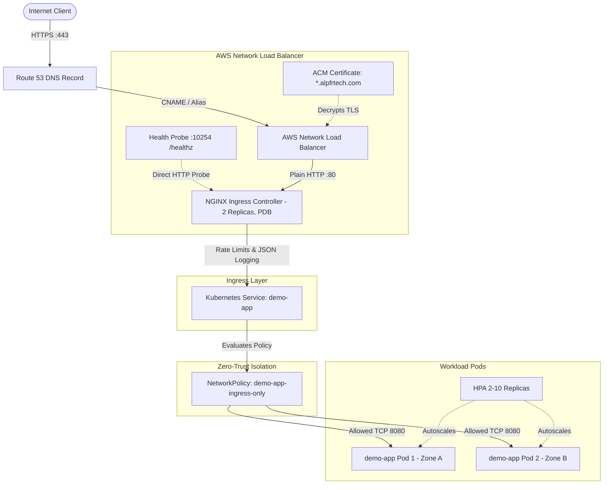

# AWS EKS Auto Mode + NLB + Ingress NGINX + ACM + Route 53

[](https://github.com/alpfr/dns-lb-ingress-service-pods/actions/workflows/ci.yml)
[](https://aws.amazon.com/eks/)
[](https://www.terraform.io/)
[](https://kubernetes.github.io/ingress-nginx/)
[](https://aws.amazon.com/route53/)
[](https://opensource.org/licenses/MIT)

A production-grade, enterprise-hardened Terraform starter demonstrating automated end-to-end traffic ingress on **Amazon EKS Auto Mode**, routing from a custom Route 53 domain through an **AWS Network Load Balancer (NLB)** with **AWS Certificate Manager (ACM)** TLS termination, into an in-cluster **NGINX Ingress Controller**, and down to secure, non-root microservice pods.

---

## Architecture Overview

```
                                      AWS CLOUD INFRASTRUCTURE
 ───────────────────────────────────────────────────────────────────────────────────────────────────
                                         
   [Internet Client]
          │
          │ HTTPS (443) / TLS
          ▼
   [Amazon Route 53] ── (DNS: app.alpfrtech.com -> NLB DNS Name | CAA: amazon.com)
          │
          ▼
 ┌─────────────────────────────────────────────────────────────────────────────────────────────────┐
 │ AWS Network Load Balancer (Internet-Facing NLB)                                                 │
 │                                                                                                 │
 │   • TLS Termination: ACM Public Certificate (*.alpfrtech.com / app.alpfrtech.com)               │
 │   • Target Type: IP (Direct Pod Routing / Cross-Zone Load Balancing)                            │
 │   • Dedicated HTTP Health Probe: /healthz on port 10254                                         │
 │   • Protocol to Ingress: Plain TCP / HTTP on Port 80                                            │
 └───────────────────────────────────────────────────┬─────────────────────────────────────────────┘
                                                     │
                                                     │ Plain TCP / HTTP (80)
                                                     ▼
 ┌─────────────────────────────────────────────────────────────────────────────────────────────────┐
 │ Amazon EKS Cluster (EKS Auto Mode: Node Pools: "general-purpose")                               │
 │                                                                                                 │
 │   Namespace: ingress-nginx                                                                      │
 │   ┌─────────────────────────────────────────────────────────────────────────────────────────┐   │
 │   │ Ingress NGINX Controller Pods (Replicas: 2 | PDB: minAvailable 1)                       │   │
 │   │                                                                                         │   │
 │   │   • Multi-AZ Topology Spread (topology.kubernetes.io/zone)                              │   │
 │   │   • Host-Based & Path-Based Layer 7 Routing                                             │   │
 │   │   • ssl-redirect: "false" (Prevents ERR_TOO_MANY_REDIRECTS loop)                        │   │
 │   │   • use-forwarded-headers: "true" (Preserves client IP & X-Forwarded-Proto)             │   │
 │   │   • Rate Limiting: 50 rps | 20 max connections | 10MB payload size                      │   │
 │   │   • Structured JSON Access Logging (log-format-escape-json = "true")                    │   │
 │   │   • Prometheus Metrics Enabled on port 10254                                            │   │
 │   └─────────────────────────────────────────────┬───────────────────────────────────────────┘   │
 │                                                 │                                               │
 │                                                 │ ClusterIP (Port 80)                           │
 │                                                 ▼                                               │
 │   Namespace: default                                                                            │
 │   ┌─────────────────────────────────────────────────────────────────────────────────────────┐   │
 │   │ Kubernetes Service: demo-app (ClusterIP)                                                │   │
 │   │   • TargetPort: 8080                                                                    │   │
 │   └─────────────────────────────────────────────┬───────────────────────────────────────────┘   │
 │                                                 │                                               │
 │                                                 ▼                                               │
 │   ┌─────────────────────────────────────────────────────────────────────────────────────────┐   │
 │   │ Zero-Trust Kubernetes NetworkPolicy (demo-app-ingress-only)                             │   │
 │   │   • Enforces strict Ingress to TCP 8080 ONLY from namespace ingress-nginx              │   │
 │   └─────────────────────────────────────────────┬───────────────────────────────────────────┘   │
 │                                                 │                                               │
 │                                                 │ TargetPort (8080)                             │
 │                                                 ▼                                               │
 │   ┌─────────────────────────────────────────────────────────────────────────────────────────┐   │
 │   │ Flask Microservice Pods (HPA: 2-10 replicas | PDB: minAvailable 1)                      │   │
 │   │                                                                                         │   │
 │   │   • Multi-AZ Topology Spread (topology.kubernetes.io/zone)                              │   │
 │   │   • Non-Root Execution (UID 10001, GID 10001)                                           │   │
 │   │   • Linux Capabilities: ALL dropped                                                     │   │
 │   │   • Read-Only Root Filesystem (with /tmp emptyDir)                                      │   │
 │   │   • Seccomp Profile: RuntimeDefault                                                     │   │
 │   │   • Horizontal Pod Autoscaler: CPU 70%, Memory 80%                                      │   │
 │   │   • HTTP Endpoints: / (Root JSON status), /healthz (Liveness & Readiness probe)         │   │
 │   └─────────────────────────────────────────────────────────────────────────────────────────┘   │
 └─────────────────────────────────────────────────────────────────────────────────────────────────┘
```

### Mermaid Flow Diagram



---

## Key Architectural Decisions & Engineering Mitigations

### 1. SSL Offloading & Infinite Redirect Loop Mitigation
- **The Challenge**: When HTTPS traffic terminates at an AWS NLB using an ACM certificate, the NLB forwards decrypted traffic downstream to Ingress NGINX over plain TCP/HTTP on port 80. By default, NGINX Ingress enforces SSL redirection (`ssl-redirect: "true"`). Because incoming traffic reaches the ingress pod on HTTP, NGINX repeatedly responds with `308 Permanent Redirect` back to `https://...`, creating an **`ERR_TOO_MANY_REDIRECTS`** browser loop.
- **The Solution**: 
  - The ingress resource explicitly sets `"nginx.ingress.kubernetes.io/ssl-redirect" = "false"`.
  - Ingress NGINX controller ConfigMap enables `"use-forwarded-headers" = "true"`, allowing downstream applications to accurately inspect `X-Forwarded-Proto` and `X-Forwarded-For`.

### 2. Elimination of NLB Hostname Provisioning Race Condition
- **The Challenge**: When deploying Helm charts that create AWS LoadBalancers, Kubernetes provisions the cloud infrastructure asynchronously. Attempting to query the `kubernetes_service_v1` status immediately causes Terraform to fail during initial apply because the NLB hostname is not yet populated.
- **The Solution**: 
  - Integrated `time_sleep.wait_for_ingress_lb` with an automated 45-second stabilization window between Helm controller creation and Route 53 record resolution.
  - Added `allow_overwrite = true` on Route 53 validation and application DNS records to eliminate stale record collisions.

### 3. Native EKS Auto Mode Compute
- **The Advantage**: Uses AWS EKS Auto Mode (`compute_config = { enabled = true, node_pools = ["general-purpose"] }`). EKS dynamically provisions, patches, and scales AWS-optimized EC2 compute instances on-demand without managing separate EC2 Auto Scaling Groups or installing separate cluster autoscalers.

### 4. Dynamic Provider Authentication (No Token Expiry)
- **The Challenge**: Using `data "aws_eks_cluster_auth"` injects a static authentication token into the Terraform state that expires in 15 minutes. VPC and EKS cluster creation often takes 12–18 minutes, resulting in `401 Unauthorized` errors when Terraform attempts to apply Kubernetes and Helm resources.
- **The Solution**: The `kubernetes` and `helm` providers use dynamic client authentication via `aws eks get-token` in their `exec` blocks, generating a fresh, valid token for every single API request.

### 5. Multi-AZ Ingress High Availability & Native Health Probes
- **Ingress Controller Redundancy**: Configured with `replicaCount: 2`, `minAvailable: 1` Pod Disruption Budget, and `topologySpreadConstraints` ensuring controller pods are scheduled across distinct Availability Zones.
- **Dedicated NLB Health Check**: NLB targets are checked via native HTTP `GET /healthz` on port `10254` rather than generic TCP connection checks, preventing traffic routing to unready ingress controllers.
- **Prometheus Metrics**: Controller metrics are enabled out-of-the-box on port `10254` for integration with Prometheus, Datadog, or CloudWatch Container Insights.

### 6. Workload Auto-scaling & Disruption Resilience
- **Horizontal Pod Autoscaling (HPA)**: Dynamically scales `demo-app` pods between 2 and 10 replicas based on 70% CPU and 80% Memory thresholds.
- **Pod Disruption Budget (PDB)**: Enforces `min_available = 1` during EKS automated node recycling and rolling updates.
- **Topology Spread**: Distributes workload pods across zones (`topology.kubernetes.io/zone`) to guarantee fault tolerance against AZ outages.

### 7. Defense-in-Depth Container & State Security
- **S3 State Storage**: Bootstrap module enforces `BucketOwnerEnforced` (legacy ACLs disabled), AES-256 encryption, versioning, public access blocks, and native S3 state locking (`use_lockfile = true`).
- **Read-Only Root Filesystem**: Application container enforces `read_only_root_filesystem = true`, runs as UID `10001`, drops all Linux capabilities (`drop = ["ALL"]`), and mounts an ephemeral `emptyDir` on `/tmp`.
- **DNS CAA Record**: Route 53 includes a Certification Authority Authorization (CAA) record explicitly restricting TLS certificate issuance to `amazon.com`.

### 8. Automated CI/CD Governance Pipeline
- A GitHub Actions workflow ([`.github/workflows/ci.yml`](.github/workflows/ci.yml)) automatically runs on all pushes and PRs to `main`, validating Terraform formatting and syntax, Python bytecode compilation, Flake8 style compliance, shell script syntax (`bash -n`), and container image builds.

### 9. Existing VPC Auto-Discovery & Zero-Impact Reusability
- Supports deploying directly into pre-existing VPCs in `us-east-1` (such as existing cluster VPCs) with automatic private/public subnet discovery.
- The deployment script queries AWS, ranks healthy VPCs possessing active Internet Gateways and NAT Gateways, and allows selecting via CLI flag (`--vpc-id <id>`) or interactive menu.
- Teardown via `scripts/destroy.sh` safely preserves existing VPCs and subnets, only destroying Terraform-managed workloads and DNS entries.

### 10. EKS Access Entry Propagation & RBAC Dependency Hardening
- Hardens Kubernetes resource dependencies (`depends_on = [module.eks]`) against control-plane auth cache propagation delays for newly attached `AmazonEKSClusterAdminPolicy` access entries.
- Added automatic secondary reconciliation apply in `scripts/deploy.sh` to ensure completely hands-off execution without transient failures.

### 11. Amazon ECR Vulnerability Scanning & Image Lifecycle Retention
- **Automated Scan on Push**: Every image pushed to Amazon ECR triggers automated CVE vulnerability scanning (`scanOnPush = true`), alerting teams to common base image vulnerabilities prior to cluster deployment.
- **Automated Lifecycle Policy**: Cleans up dangling untagged images older than 14 days and retains only the 10 most recent images, eliminating storage bloat and AWS ECR storage costs.

### 12. Zero-Trust Kubernetes NetworkPolicy (Ingress Isolation)
- **Pod-to-Pod Traffic Segmentation**: Implements `kubernetes_network_policy_v1.app_ingress_isolation` in the `default` namespace.
- **Strict Ingress Rule**: Drops all traffic to `demo-app` pods on port 8080 *except* requests originating from pods labeled `app.kubernetes.io/name = ingress-nginx` residing inside the `ingress-nginx` namespace. This prevents compromised workloads in other namespaces or pods from moving laterally within the cluster network.

### 13. Wildcard & Apex Subject Alternative Names (SANs) on ACM
- **Broad Domain Coverage**: The public ACM certificate covers both the root apex (`alpfrtech.com`), the primary service subdomain (`app.alpfrtech.com`), and all future subdomains via wildcard (`*.alpfrtech.com`).
- **Collision-Resistant DNS Validation**: Terraform keys Route 53 validation records by `dvo.domain_name` with `allow_overwrite = true`, preventing duplicate key collisions in Terraform state while ensuring AWS validates both apex and wildcard SANs simultaneously.

### 14. Layer 7 Rate Limiting & Connection Throttling
- **Ingress NGINX Rate Limiting**: Ingress resource specifies `nginx.ingress.kubernetes.io/limit-rps = "50"` and `limit-connections = "20"`.
- **Payload Protection**: Sets `nginx.ingress.kubernetes.io/proxy-body-size = "10m"`, mitigating Denial of Service (DoS) attacks, brute-force bursts, and large payload buffer exhaustion.

### 15. Structured JSON Upstream Access Logging
- **Observability & Analytics**: Ingress NGINX controller ConfigMap configures `log-format-escape-json = "true"` and emits uniform JSON access log records with timestamp, client IP, host, HTTP method, upstream status, request time, and upstream response time.
- **Log Shipper Compatibility**: Ready for immediate parsing by CloudWatch Container Insights, AWS OpenSearch, Datadog, or Grafana Loki without complex grok patterns.

---

## Repository Layout

```
dns-lb-ingress-service-pods/
├── README.md                                  # Repository overview and primary documentation
├── .gitignore                                 # Git ignore patterns for Terraform, Python, and OS files
├── .github/
│   └── workflows/
│       └── ci.yml                             # Automated GitHub Actions CI pipeline
├── scripts/                                   # Automated orchestration and operational scripts
│   ├── deploy.sh                              # Complete end-to-end automated deployment suite
│   ├── verify.sh                              # Post-deployment health checks and smoke testing
│   └── destroy.sh                             # Safe infrastructure teardown and resource cleanup
└── eks-nlb-acm-route53-demo/
    ├── README.md                              # Sub-module operational guide
    ├── bootstrap/                             # Terraform S3 backend storage module
    │   ├── main.tf                            # Encrypted, versioned S3 bucket configuration
    │   ├── variables.tf                       # Region and bucket prefix variables
    │   └── versions.tf                        # Terraform and AWS provider constraints
    ├── infra/                                 # Main infrastructure & workload module
    │   ├── main.tf                            # VPC, EKS, ACM, Ingress-NGINX (2x, PDB), Route 53, HPA, PDB
    │   ├── variables.tf                       # Configurable parameters (domain, region, image, tags)
    │   ├── outputs.tf                         # Application URL, cluster endpoint, NLB hostname
    │   ├── versions.tf                        # Provider requirements (aws, kubernetes, helm, time)
    │   ├── backend.tf.example                 # Template for remote S3 state configuration
    └── app/                                   # Containerized Python Flask microservice
        ├── app.py                             # Application source code with / and /healthz endpoints
        ├── Dockerfile                         # Multi-stage, non-root hardened container image
        ├── requirements.txt                   # Flask and Gunicorn runtime dependencies
        └── .dockerignore                      # Build context ignore rules
```

---

## Quick Start: Automated Deployment

You can deploy the complete infrastructure and application using the automated orchestration suite in `scripts/`:

```bash
# 1. Clone or navigate to the repository
cd dns-lb-ingress-service-pods

# 2. Run the end-to-end deployment script (auto-detects existing VPC in us-east-1 or specify one)
./scripts/deploy.sh --domain alpfrtech.com

# Deploy into a specific existing VPC:
./scripts/deploy.sh --vpc-id vpc-04069dd8bf42ea2db -y

# Or force creation of a brand new dedicated VPC:
./scripts/deploy.sh --create-vpc -y
```

### Operational Scripts Reference

| Script | Purpose | Example Command |
| :--- | :--- | :--- |
| **`scripts/deploy.sh`** | Full end-to-end automation: auto-discovers healthy VPCs in region, bootstraps S3 state bucket, creates ECR repo, builds & pushes image, configures backend/tfvars, applies Terraform, and verifies | `./scripts/deploy.sh --vpc-id vpc-04069dd8bf42ea2db -y` |
| **`scripts/verify.sh`** | Runs cluster connectivity, node status, Ingress controller NLB status, VPC verification, and probes `/healthz` and `/` endpoints | `./scripts/verify.sh -d alpfrtech.com` |
| **`scripts/destroy.sh`** | Safely tears down the EKS cluster, NLB, Route 53 records (preserves existing VPC intact), with options to delete ECR image repo and S3 state bucket | `./scripts/destroy.sh -y --delete-ecr` |

---

## Manual Step-by-Step Deployment Guide

### Prerequisites
Before proceeding, verify that your local development workstation has:
1. **AWS CLI** (v2) installed and authenticated with Administrator privileges:
   ```bash
   aws sts get-caller-identity
   ```
2. **Terraform** (`>= 1.10.0`) installed:
   ```bash
   terraform -version
   ```
3. **Docker** installed and running:
   ```bash
   docker info
   ```
4. **kubectl** installed:
   ```bash
   kubectl version --client
   ```
5. An existing **Public Route 53 Hosted Zone** registered in your AWS account (e.g., `alpfrtech.com`).

---

### Step 1: Bootstrap Remote S3 State Storage

Deploy the S3 bucket used for encrypted Terraform remote state management:

```bash
cd eks-nlb-acm-route53-demo/bootstrap

# 1. Initialize and apply the bootstrap module
terraform init
terraform apply -auto-approve

# 2. Capture the generated bucket name
STATE_BUCKET=$(terraform output -raw state_bucket)
echo "S3 Remote State Bucket: $STATE_BUCKET"
```

---

### Step 2: Build and Push Microservice Image to Amazon ECR

Build the hardened Docker container and push it to a private Amazon ECR repository:

```bash
cd ../app

# 1. Export deployment variables
AWS_REGION="us-east-1"
ACCOUNT_ID=$(aws sts get-caller-identity --query Account --output text)
ECR_REPO_NAME="demo-app"
IMAGE_TAG="v1"
ECR_URI="${ACCOUNT_ID}.dkr.ecr.${AWS_REGION}.amazonaws.com/${ECR_REPO_NAME}:${IMAGE_TAG}"

# 2. Create the ECR repository (if not already present)
aws ecr create-repository --repository-name "$ECR_REPO_NAME" --region "$AWS_REGION" 2>/dev/null || true

# 3. Configure automated vulnerability scanning and image retention lifecycle policy
aws ecr put-image-scanning-configuration --repository-name "$ECR_REPO_NAME" --image-scanning-configuration scanOnPush=true --region "$AWS_REGION"
aws ecr put-lifecycle-policy --repository-name "$ECR_REPO_NAME" --region "$AWS_REGION" \
    --lifecycle-policy-text '{"rules":[{"rulePriority":1,"description":"Expire untagged images older than 14 days","selection":{"tagStatus":"untagged","countType":"sinceImagePushed","countUnit":"days","countNumber":14},"action":{"type":"expire"}},{"rulePriority":2,"description":"Keep last 10 images","selection":{"tagStatus":"any","countType":"imageCountMoreThan","countNumber":10},"action":{"type":"expire"}}]}'

# 4. Authenticate Docker with Amazon ECR
aws ecr get-login-password --region "$AWS_REGION" | docker login --username AWS --password-stdin "${ACCOUNT_ID}.dkr.ecr.${AWS_REGION}.amazonaws.com"

# 4. Build, tag, and push the image
docker build -t "${ECR_REPO_NAME}:${IMAGE_TAG}" .
docker tag "${ECR_REPO_NAME}:${IMAGE_TAG}" "$ECR_URI"
docker push "$ECR_URI"

echo "Image successfully pushed to: $ECR_URI"
```

---

### Step 3: Configure Infrastructure Variables & Backend

Navigate to the `infra/` directory and configure your backend and variable definitions:

```bash
cd ../infra

# 1. Configure the remote state backend
cp backend.tf.example backend.tf
```

Edit `backend.tf` and replace `REPLACE_WITH_BOOTSTRAP_OUTPUT` with your `$STATE_BUCKET` name:
```hcl
terraform {
  backend "s3" {
    bucket       = "eks-demo-tfstate-xxxxxxxx"
    key          = "eks-demo/terraform.tfstate"
    region       = "us-east-1"
    encrypt      = true
    use_lockfile = true
  }
}
```

Create your `terraform.tfvars`:
```bash
cp terraform.tfvars.example terraform.tfvars
```

Update `terraform.tfvars` with your specific domain name and ECR image URI:
```hcl
aws_region                  = "us-east-1"
cluster_name                = "demo-eks"
domain_name                 = "alpfrtech.com"      # Replace with your Route 53 public hosted zone
app_subdomain               = "app"              # Yields https://app.alpfrtech.com
app_image                   = "<ACCOUNT_ID>.dkr.ecr.us-east-1.amazonaws.com/demo-app:v1"
ingress_nginx_chart_version = "4.15.1"
tags = {
  Environment = "Production"
  ManagedBy   = "Terraform"
  Project     = "EKS-NLB-Demo"
}
```

---

### Step 4: Provision Infrastructure & Workload

Execute Terraform to deploy the VPC, EKS Auto Mode cluster, ACM certificate with DNS validation, Ingress NGINX Helm chart, Route 53 CNAME, and Kubernetes deployment:

```bash
# 1. Initialize Terraform providers and remote state
terraform init

# 2. Validate configuration syntax and consistency
terraform fmt -check
terraform validate

# 3. Plan and review changes
terraform plan -out=tfplan

# 4. Apply changes (Cluster creation takes ~12-15 minutes)
terraform apply tfplan
```

---

### Step 5: Verification & Health Checks

#### 1. Configure Local `kubectl`
```bash
aws eks update-kubeconfig --region us-east-1 --name demo-eks
```

#### 2. Inspect Ingress & Pod Status
```bash
# Verify pods are in Running state
kubectl get pods -l app=demo-app -o wide

# Verify Ingress NGINX controller has an assigned external LoadBalancer hostname
kubectl get svc -n ingress-nginx ingress-nginx-controller

# Verify Ingress routing rule and rate limiting annotations
kubectl get ingress demo-app
kubectl get ingress demo-app -o jsonpath='{.metadata.annotations}'

# Verify Zero-Trust NetworkPolicy isolation
kubectl get networkpolicy -n default demo-app-ingress-only

# Verify Ingress NGINX structured JSON access logs
kubectl logs -n ingress-nginx -l app.kubernetes.io/name=ingress-nginx --tail=5
```

#### 3. Test DNS Resolution and Public HTTPS Endpoints
```bash
# Query the live application health probe
curl -i https://app.alpfrtech.com/healthz

# Expected Response:
# HTTP/2 200
# content-type: application/json
# {"status":"ok"}

# Query the root endpoint
curl -i https://app.alpfrtech.com/

# Expected Response:
# HTTP/2 200
# content-type: application/json
# {
#   "message": "Hello from Kubernetes on AWS",
#   "pod": "demo-app-xxxxxxxxxx-xxxxx",
#   "status": "running"
# }
```

---

### Step 6: Teardown & Resource Cleanup

To remove all provisioned cloud resources and prevent ongoing AWS charges:

```bash
# 1. Destroy infrastructure, EKS cluster, NLB, and Route 53 records
cd eks-nlb-acm-route53-demo/infra
terraform destroy -auto-approve

# 2. (Optional) Destroy the remote state S3 bucket
cd ../bootstrap
# Note: Empty all state file versions from the bucket in AWS console or CLI before destroying:
aws s3 rm "s3://${STATE_BUCKET}" --recursive
terraform destroy -auto-approve
```

---

## Production Considerations

| Topic | Repository Default | Enterprise Recommendations |
| :--- | :--- | :--- |
| **Ingress High Availability** | 2 replicas, `minAvailable: 1` PDB, multi-AZ spread | Scale to 3+ replicas across 3 availability zones for high-throughput enterprise workloads. |
| **Zero-Trust Network Isolation** | Ingress restricted to `ingress-nginx` via NetworkPolicy | Add Calico or AWS VPC CNI egress policies to prevent unauthorized outbound connections. |
| **Layer 7 Rate Limiting** | 50 rps, 20 connections, 10MB payload | Adjust thresholds in `kubernetes_ingress_v1.app` per API endpoint SLA requirements. |
| **Observability** | Structured JSON access logs with upstream latency metrics | Route container logs to Amazon CloudWatch Container Insights or AWS OpenSearch via FluentBit. |
| **ACM TLS Certificates** | Subdomain (`app.alpfrtech.com`), apex (`alpfrtech.com`), and wildcard (`*.alpfrtech.com`) | Configure automated Route 53 DNS failover or CloudFront CDN edge distribution. |
| **ECR Image Security** | Automated CVE scan on push, 14-day untagged prune, 10 tagged image retention | Integrate AWS Inspector continuous container vulnerability scanning and signing with Cosign. |
| **NAT Gateways** | `single_nat_gateway = true` (Cost-optimized) | Set `single_nat_gateway = false` and `one_nat_gateway_per_az = true` for high availability across AZs. |

---

## Troubleshooting Matrix

| Issue | Root Cause | Resolution |
| :--- | :--- | :--- |
| **Browser: `ERR_TOO_MANY_REDIRECTS`** | Ingress controller enforces SSL redirect while receiving plain HTTP from the NLB. | Verify `nginx.ingress.kubernetes.io/ssl-redirect: "false"` is set on `kubernetes_ingress_v1.app`. |
| **ACM Validation Pending** | Route 53 DNS record does not match ACM challenge string or nameservers are inactive. | Inspect Route 53 hosted zone NS records with `dig NS alpfrtech.com` to ensure public delegation is active. |
| **Terraform Plan: Status Hostname Empty** | NLB was queried before AWS assigned a public DNS name. | Ensure `time_sleep.wait_for_ingress_lb` (45s) is declared as a dependency before `data.kubernetes_service_v1.ingress`. |
| **`401 Unauthorized` during apply** | Static EKS token expired during long cluster creation. | Ensure `kubernetes` and `helm` providers use dynamic `exec` authentication (`aws eks get-token`). |
| **`ImagePullBackOff` on Pods** | ECR repository does not exist, container image was not pushed, or IAM role lacks ECR pull permissions. | Verify image was pushed using `aws ecr list-images --repository-name demo-app` and tag matches `app_image`. |

---

## Contributing & Support

Issues and pull requests are welcome. For questions or feature suggestions, please open an issue in the [GitHub issue tracker](https://github.com/alpfr/dns-lb-ingress-service-pods/issues).
