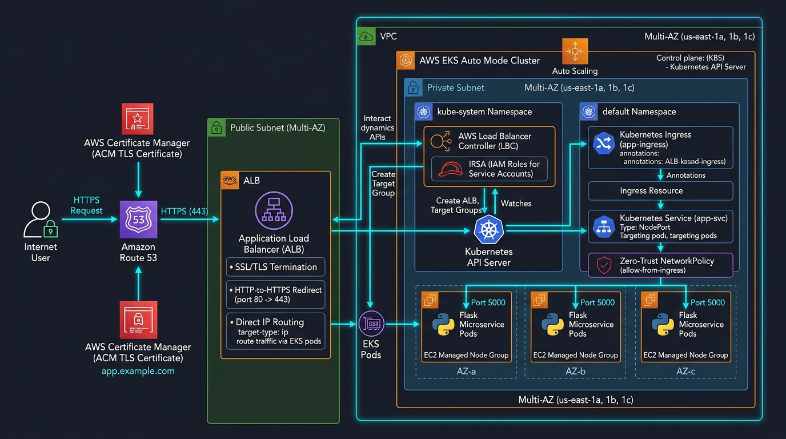
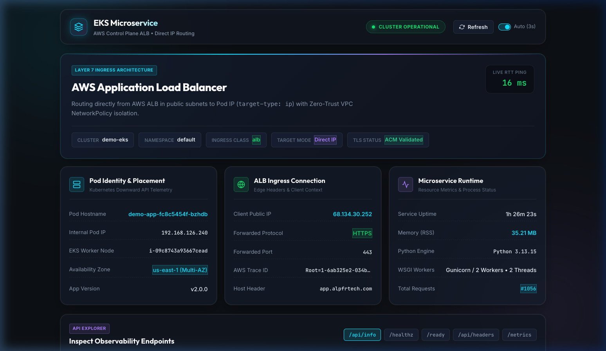

# EKS Auto Mode + AWS ALB + AWS Load Balancer Controller + ACM + Route 53 Demo

[](https://www.terraform.io/)
[](https://kubernetes.io/)
[](https://aws.github.io/eks-charts)

This module contains the complete, production-ready implementation of an **Amazon EKS Auto Mode** cluster with automated **AWS Application Load Balancer (ALB)** provisioning, ACM TLS termination, direct pod routing (`target-type: ip`) managed by the **AWS Load Balancer Controller**, and Route 53 public DNS integration.

> **🌐 Live Application URL**: **[https://app.alpfrtech.com](https://app.alpfrtech.com)**  
> **Telemetry & Observability**: [Liveness Probe](https://app.alpfrtech.com/healthz) • [Readiness Probe](https://app.alpfrtech.com/ready) • [Cluster Telemetry](https://app.alpfrtech.com/api/info) • [Prometheus Metrics](https://app.alpfrtech.com/metrics)

---

## Architecture & Live Dashboard

<p align="center">
  
</p>

### Live Application Telemetry Dashboard
<p align="center">
  
</p>

```
[Internet Client]
       │
       │  HTTPS (443) / TLS
       ▼
[Amazon Route 53 Public Hosted Zone] (CNAME: app.alpfrtech.com -> ALB DNS)
       │
       ▼
[AWS Application Load Balancer (ALB)] (AWS Control Plane Managed, TLS Terminated with ACM Certificate)
       │  • Native HTTP-to-HTTPS SSL Redirect (Port 80 -> 443)
       │  • Direct Health Probes (/healthz on traffic-port)
       │  • Target Type: IP (Direct Pod Routing / Zero Worker Node Proxy Overhead)
       │
       ▼ (Direct routing to Pod IP on Port 8080)
[Zero-Trust NetworkPolicy: demo-app-ingress-only] (Permits port 8080 from VPC CIDR)
       │
       ▼
[Hardened Flask Pods running via Gunicorn] (Non-root UID 10001, HPA 2-10 replicas)
```

---

## Architecture & Design Highlights

- **EKS Auto Mode**: Dynamically manages EC2 node pools (`general-purpose`) with automated node provisioning and scaling without requiring manual node group or Karpenter installations.
- **AWS-Managed Application Load Balancer (Control Plane Managed)**: Eliminates in-cluster proxy pods (like Ingress-NGINX) from worker nodes. Layer-7 routing, SSL termination, path routing, and target health checking are executed natively by the AWS ALB.
- **AWS Load Balancer Controller with IRSA**: Deploys the official AWS Load Balancer Controller into `kube-system` using IAM Roles for Service Accounts (IRSA) with fine-grained AWS IAM permissions.
- **Direct Pod IP Routing (`target-type: ip`)**: The ALB routes traffic directly from VPC subnets to individual pod IPs, bypassing `kube-proxy` NAT hops, node port translation, and intermediate proxy pods for optimal latency and performance.
- **Existing VPC Reuse or Dedicated Provisioning**: Supports deploying directly into any existing VPC (e.g. `vpc-04069dd8bf42ea2db` in `us-east-1`) with automated subnet discovery, or cleanly provisioning a dedicated multi-AZ VPC with NAT Gateway.
- **Automated SSL Redirect & TLS Termination**: The AWS ALB terminates TLS using a public ACM certificate validated via Route 53 DNS records, and enforces automated HTTP-to-HTTPS redirection (`ssl-redirect = "443"`).
- **Direct Target Health Checks**: The ALB conducts direct application-level health checks against `/healthz` on the microservice container port.
- **Workload Resilience & Auto-scaling**: Deploys `demo-app` with Horizontal Pod Autoscaling (2–10 replicas), Pod Disruption Budget (`minAvailable: 1`), and zone topology spread constraints.
- **Defense-in-Depth Security**:
  - **Read-Only Root Filesystem**: Microservice pods run with `read_only_root_filesystem = true` and a dedicated `emptyDir` mount for `/tmp`.
  - **Non-Root & Capability Drop**: Runs as UID `10001` with all Linux capabilities dropped and `RuntimeDefault` seccomp.
  - **Route 53 CAA Record**: Restricts public certificate issuance strictly to `amazon.com`.
  - **S3 State Storage**: Enforces `BucketOwnerEnforced`, encryption, versioning, public access blocks, and native S3 state locking.
- **Zero-Trust NetworkPolicy (VPC Ingress Isolation)**: Kubernetes `NetworkPolicy` restricts inbound pod traffic on port 8080 strictly to VPC CIDR IP blocks, preventing unauthorized cluster-internal pod traversals while enabling direct ALB target-group health checks and traffic.
- **Wildcard & Apex Subject Alternative Names (SANs)**: Public ACM certificate covers `app.alpfrtech.com`, root apex `alpfrtech.com`, and `*.alpfrtech.com`.
- **ECR Scanning & Retention Lifecycle**: Container repository is configured with `scanOnPush = true` and automated lifecycle pruning of untagged images >14 days while retaining the last 10 images.
- **Dynamic Provider Authentication**: The `kubernetes` and `helm` Terraform providers use `aws eks get-token` via dynamic `exec` blocks, avoiding the 15-minute token expiration issue during long cluster creation runs.
- **Access Entry & RBAC Hardening**: Explicit `depends_on` relationships prevent race conditions between newly attached `AmazonEKSClusterAdminPolicy` access entries and Kubernetes service/ingress manifest application.
- **Network & WSGI Tuning**: Gunicorn uses `--keep-alive 65` (exceeding the ALB 60s idle timeout) with 2 workers and 2 threads.

---

## Directory Structure

```
eks-nlb-acm-route53-demo/
├── README.md                          # This module operational documentation
├── bootstrap/                         # Terraform module for remote S3 state storage
│   ├── main.tf                        # S3 bucket, versioning, encryption, ownership controls
│   ├── variables.tf                   # Region and bucket prefix variables
│   └── versions.tf                    # AWS provider constraints
├── infra/                             # Core infrastructure and Kubernetes workloads
│   ├── main.tf                        # VPC (conditional), EKS Auto Mode, ACM, AWS Load Balancer Controller (ALB), Route 53, HPA, PDB
│   ├── variables.tf                   # Input variable definitions (domain_name, vpc_id, subnet_ids)
│   ├── outputs.tf                     # Output endpoints, VPC ID, and ALB connection data
│   ├── versions.tf                    # Terraform, AWS, Kubernetes, Helm, Time provider constraints
│   ├── backend.tf.example             # Template for S3 remote backend
│   └── terraform.tfvars.example       # Template for environment input variables
└── app/                               # Enterprise Python Flask Full-Stack Microservice
    ├── app.py                         # Application logic with /healthz, /ready, /api/info, /api/headers, /metrics
    ├── templates/
    │   └── dashboard.html             # Glassmorphic responsive dark-mode telemetry web dashboard
    ├── static/
    │   ├── css/styles.css             # Custom Vanilla CSS design tokens & animations
    │   └── js/dashboard.js            # Auto-refresh polling, RTT ping, and API explorer
    ├── tests/
    │   └── test_app.py                # Comprehensive pytest test suite (7/7 unit tests)
    ├── Dockerfile                     # Multi-stage, non-root hardened container
    ├── requirements.txt               # Flask and Gunicorn runtime dependencies
    └── .dockerignore                  # Docker build exclusions
```

---

## Quick Start (Automated Scripts)

For end-to-end automated deployment without manual execution:

```bash
# Deploy with auto-discovery of existing VPC:
./scripts/deploy.sh --domain alpfrtech.com -y

# Deploy into a specific existing VPC:
./scripts/deploy.sh --vpc-id vpc-04069dd8bf42ea2db -y

# Force creating a new dedicated VPC:
./scripts/deploy.sh --create-vpc -y

# Verify health probes:
./scripts/verify.sh --domain alpfrtech.com

# Teardown (existing VPC remains completely preserved):
./scripts/destroy.sh
```

---

## Complete Deployment Instructions (Manual Walkthrough)

### Prerequisites Check
Before executing, ensure you have:
1. **AWS CLI** configured (`aws sts get-caller-identity`).
2. **Terraform** (`>= 1.10.0`) installed (`terraform -version`).
3. **Docker** running (`docker info`).
4. **kubectl** installed (`kubectl version --client`).
5. An active **Public Route 53 Hosted Zone** (e.g., `alpfrtech.com`).

---

### Step 1: Bootstrap S3 Remote State
Create the encrypted, versioned S3 bucket for Terraform state:
```bash
cd bootstrap
terraform init
terraform apply -auto-approve

# Note the generated bucket name
STATE_BUCKET=$(terraform output -raw state_bucket)
echo "State Bucket: $STATE_BUCKET"
```

---

### Step 2: Build and Push Application Image
Create an Amazon ECR repository and push the hardened container image:
```bash
cd ../app

AWS_REGION="us-east-1"
ACCOUNT_ID=$(aws sts get-caller-identity --query Account --output text)
ECR_URI="${ACCOUNT_ID}.dkr.ecr.${AWS_REGION}.amazonaws.com/demo-app:v2"

# 1. Create ECR repo
aws ecr create-repository --repository-name demo-app --region "$AWS_REGION" 2>/dev/null || true

# 2. Authenticate Docker
aws ecr get-login-password --region "$AWS_REGION" | docker login --username AWS --password-stdin "${ACCOUNT_ID}.dkr.ecr.${AWS_REGION}.amazonaws.com"

# 3. Build and push image
docker build --platform linux/amd64 -t demo-app:v2 .
docker tag demo-app:v2 "$ECR_URI"
docker push "$ECR_URI"

echo "Image published to: $ECR_URI"
```

---

### Step 3: Configure Infrastructure Variables
Navigate to `infra/`:
```bash
cd ../infra

# Configure backend.tf
cp backend.tf.example backend.tf
```
Update `backend.tf` with the `$STATE_BUCKET` name created in Step 1.

Configure `terraform.tfvars`:
```bash
cp terraform.tfvars.example terraform.tfvars
```
Update `terraform.tfvars`:
```hcl
aws_region                                 = "us-east-1"
cluster_name                               = "demo-eks"
domain_name                                = "alpfrtech.com"    # Your Route 53 domain
app_subdomain                              = "app"              # Yields app.alpfrtech.com
app_image                                  = "<ACCOUNT_ID>.dkr.ecr.us-east-1.amazonaws.com/demo-app:v2"
aws_load_balancer_controller_chart_version = "1.11.0"
tags = {
  Environment = "Production"
  Project     = "EKS-Demo"
}
```

---

### Step 4: Deploy Infrastructure & Workload
```bash
terraform init
terraform fmt -check
terraform validate
terraform plan -out=tfplan
terraform apply tfplan
```

---

### Step 5: Verify the Deployment
```bash
# Update kubeconfig
aws eks update-kubeconfig --region us-east-1 --name demo-eks

# Check pod, ingress, and controller status
kubectl get pods,svc,ingress -A

# Test the live HTTPS endpoints
curl -i https://app.alpfrtech.com/healthz
curl -i https://app.alpfrtech.com/ready
curl -s https://app.alpfrtech.com/api/info | jq .
curl -i https://app.alpfrtech.com/
curl -s https://app.alpfrtech.com/metrics
```

---

### Step 6: Teardown & Resource Cleanup
```bash
cd infra
terraform destroy -auto-approve

cd ../bootstrap
aws s3 rm "s3://${STATE_BUCKET}" --recursive
terraform destroy -auto-approve
```

---

## Troubleshooting Guide

| Issue | Cause | Fix |
| :--- | :--- | :--- |
| `Could not resolve host` (curl 6) | DNS caching / propagation | Flush local DNS resolver cache (`dscacheutil -flushcache`) or query recursive DNS (`dig @1.1.1.1 app.alpfrtech.com`). |
| ALB Target `Unhealthy` | Port or healthcheck path mismatch | Verify container listens on port 8080 and `/healthz` responds with HTTP 200. Inspect via `aws elbv2 describe-target-health`. |
| Ingress Hostname Empty | Asynchronous ALB creation | `time_sleep.wait_for_ingress_lb` (45s) ensures the ALB hostname is provisioned before Route 53 CNAME creation. |
| Dynamic 401 Auth Error | Expired static token | Providers use dynamic `exec` authentication with `aws eks get-token`. |
| Pod CrashLoopBackOff | Application binding error | App binds to `0.0.0.0:$PORT` (8080) and has valid health probes on `/healthz` and `/ready`. |
