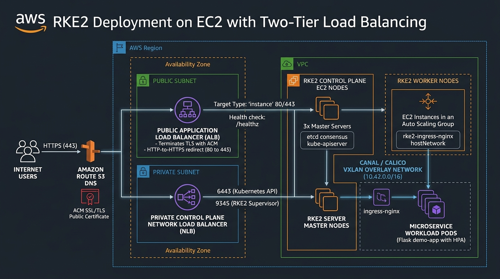
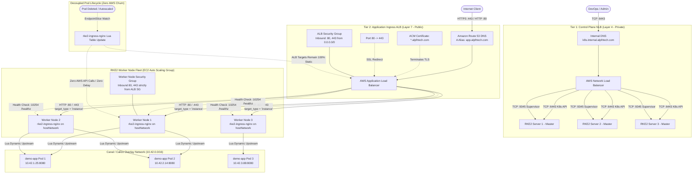

# RKE2 Application Load Balancer (ALB) to Worker Nodes Module

Production-grade Terraform module provisioning an **AWS Application Load Balancer (ALB)** targeting **RKE2 (Rancher Kubernetes Engine 2) Worker Nodes** (`target_type = "instance"`), implementing the **Enterprise Network Team Recommendation**.

---

## Architecture

<p align="center">
  
</p>

```
                                       AWS CLOUD INFRASTRUCTURE (VPC)
 ───────────────────────────────────────────────────────────────────────────────────────────────────
                                        
   [Internet Client]                                     [DevOps / Cluster Admins]
          │                                                          │
          │ HTTPS (443) / HTTP (80)                                  │ TCP (6443)
          ▼                                                          ▼
   [Amazon Route 53]                                     [Internal Route 53 / DNS]
   (app.alpfrtech.com)                                   (k8s.internal.alpfrtech.com)
          │                                                          │
          ▼                                                          ▼
 ┌──────────────────────────────────────────┐      ┌──────────────────────────────────────────┐
 │ TIER 2: PUBLIC APPLICATION INGRESS ALB   │      │ TIER 1: CONTROL PLANE NLB                │
 │ (AWS Application Load Balancer - Layer 7)│      │ (AWS Network Load Balancer - Layer 4)    │
 │                                          │      │                                          │
 │  • Public Subnets (Multi-AZ)             │      │  • Private Subnets (Multi-AZ)            │
 │  • ACM TLS Termination (*.alpfrtech.com) │      │  • TCP Pass-Through Load Balancing       │
 │  • HTTP-to-HTTPS Redirect (Port 80->443) │      │  • Port 6443 -> kube-apiserver           │
 │  • Target Type: "instance" (EC2 Workers) │      │  • Port 9345 -> RKE2 Supervisor API      │
 │  • Health Check: /healthz on Port 10254  │      │  • Health Check: TCP handshake           │
 │  • Ingress SG: 80/443 from 0.0.0.0/0     │      │  • Ingress SG: 6443/9345 from Admin CIDR │
 └────────────────────┬─────────────────────┘      └────────────────────┬─────────────────────┘
                      │                                                 │
                      │ HTTP (80/443)                                   │ TCP (6443/9345)
                      │ Target: EC2 Worker Instances                    │ Target: Master Server Instances
                      ▼                                                 ▼
 ┌──────────────────────────────────────────┐      ┌──────────────────────────────────────────┐
 │ RKE2 WORKER NODES (EC2 Auto Scaling Group│      │ RKE2 CONTROL PLANE NODES (EC2)           │
 │                                          │      │                                          │
 │  • Worker SG: Ingress strictly from ALB  │      │  • 3x Master Instances (Multi-AZ)        │
 │  • rke2-ingress-nginx (hostNetwork: 80)  │      │  • etcd consensus cluster (2379-2380)    │
 │  • Real Client IP: X-Forwarded-For       │      │  • kube-apiserver (:6443)                │
 │  • Health Probe: :10254/healthz          │      │  • Tainted: NoSchedule (No workloads)    │
 └────────────────────┬─────────────────────┘      └──────────────────────────────────────────┘
                      │
                      │ Dynamic Lua Upstream Routing (Microsecond Endpoint Sync)
                      ▼
 ┌────────────────────────────────────────────────────────────────────────────────────────────┐
 │ CANAL / CALICO VXLAN OVERLAY NETWORK (10.42.0.0/16)                                        │
 │                                                                                            │
 │   Microservice Workload Pods (demo-app)                                                    │
 │   ┌──────────────────────┐    ┌──────────────────────┐    ┌──────────────────────┐         │
 │   │ Pod 1 (10.42.1.25)   │    │ Pod 2 (10.42.2.14)   │    │ Pod 3 (10.42.3.88)   │         │
 │   │ Port: 8080 (Non-root)│    │ Port: 8080 (Non-root)│    │ Port: 8080 (Non-root)│         │
 │   └──────────────────────┘    └──────────────────────┘    └──────────────────────┘         │
 │                                                                                            │
 │   • Zero Pod Churn on AWS ALB: Pod scaling/restarts update ingress-nginx Lua in memory     │
 │   • Zero AWS API Calls: No TargetGroup DeregisterTargets calls during pod rollout          │
 │   • Complete Overlay Isolation: Pod IPs never exposed to external AWS VPC routing          │
 └────────────────────────────────────────────────────────────────────────────────────────────┘
```

### Mermaid Flow Diagram



---

## Why Target Worker Nodes in RKE2?

1. **Canal / Calico Overlay CNI**: RKE2 pod IPs (`10.42.0.0/16`) reside on a private VXLAN overlay network and are not directly routable from AWS VPC subnets. The ALB must target the EC2 Worker Node instances on native VPC IPs.
2. **Zero Pod Deletion Churn on AWS**: Pods can scale or restart without triggering AWS `DeregisterTargets` API calls. `rke2-ingress-nginx` updates internal endpoints dynamically in cluster memory.
3. **Control Plane Isolation**: RKE2 Server nodes (`rke2-server`) run `etcd` and `kube-apiserver` with `NoSchedule` taints. Application traffic is strictly directed to worker nodes.

---

## Deployment Instructions

### 1. Configure Input Variables
Copy the template and specify your VPC ID and optional worker instance IDs:

```bash
cp terraform.tfvars.example terraform.tfvars
```

Edit `terraform.tfvars`:
```hcl
aws_region          = "us-east-1"
vpc_id              = "vpc-04069dd8bf42ea2db"
domain_name         = "alpfrtech.com"
app_subdomain       = "app"
worker_instance_ids = ["i-0123456789abcdef0", "i-0123456789abcdef1"]
```

### 2. Deploy with Terraform

```bash
terraform init
terraform fmt -check
terraform validate
terraform plan -out=tfplan
terraform apply tfplan
```

### 3. Configure `rke2-ingress-nginx` for Real Client IP Preservation

On your RKE2 cluster, apply the ConfigMap patch so NGINX forwards real client IPs from the ALB:

```bash
kubectl apply -f - <<EOF
apiVersion: v1
kind: ConfigMap
metadata:
  name: rke2-ingress-nginx-controller
  namespace: kube-system
data:
  use-forwarded-headers: "true"
  compute-full-forwarded-for: "true"
  use-proxy-protocol: "false"
EOF
```

---

## Outputs

| Output | Description |
| :--- | :--- |
| `app_url` | Full public HTTPS URL (`https://app.alpfrtech.com`) |
| `alb_dns_name` | Public DNS hostname of the AWS Application Load Balancer |
| `alb_arn` | ARN of the Application Load Balancer |
| `target_group_arn` | ARN of the target group routing to RKE2 Worker Nodes |
| `alb_security_group_id` | Security Group ID of the ALB (use to restrict worker node SG) |
